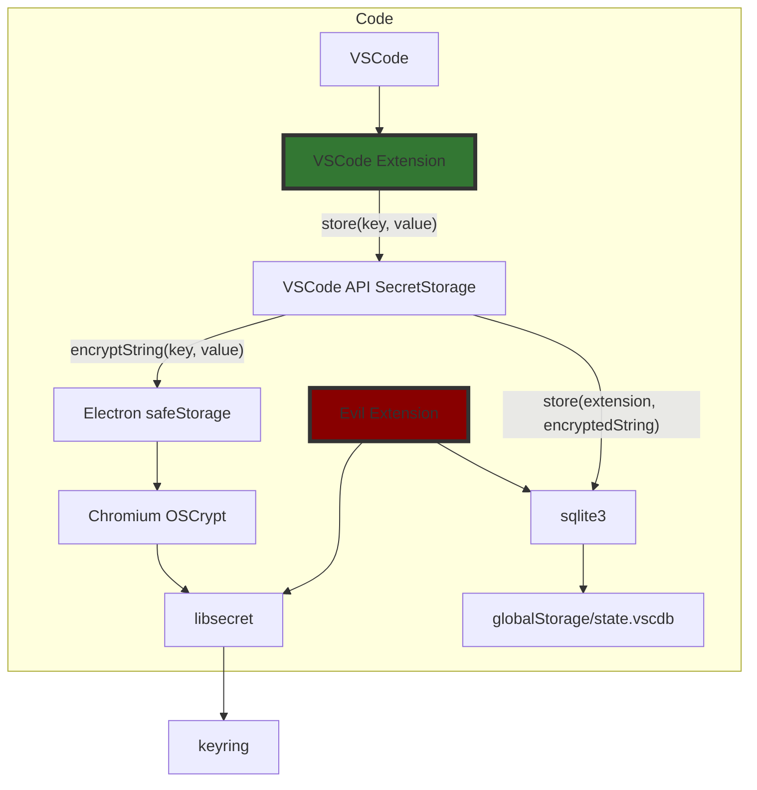
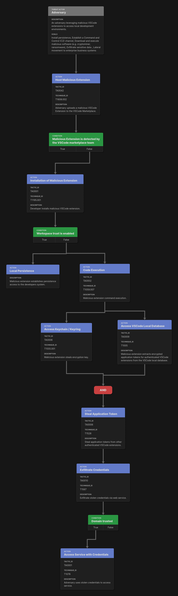

# Steal Credentials VSCode Extension

The [VSCode API](https://code.visualstudio.com/api/references/vscode-api) provides extensions with functionality to store secrets via [SecretStorage.store(key, value)](https://code.visualstudio.com/api/references/vscode-api#SecretStorage).

It stores the secrets namespaced to the extension requesting the operation.

Still, nothing prevents an evil extension to use the underlying mechanisms to steal credentials for all extensions.

## Threat Model

The overall attack flow is shown in the diagram below:

The raw file for the [attack flow builder](https://center-for-threat-informed-defense.github.io/attack-flow/ui/) is located alongside the diagram in the `img` directory.
